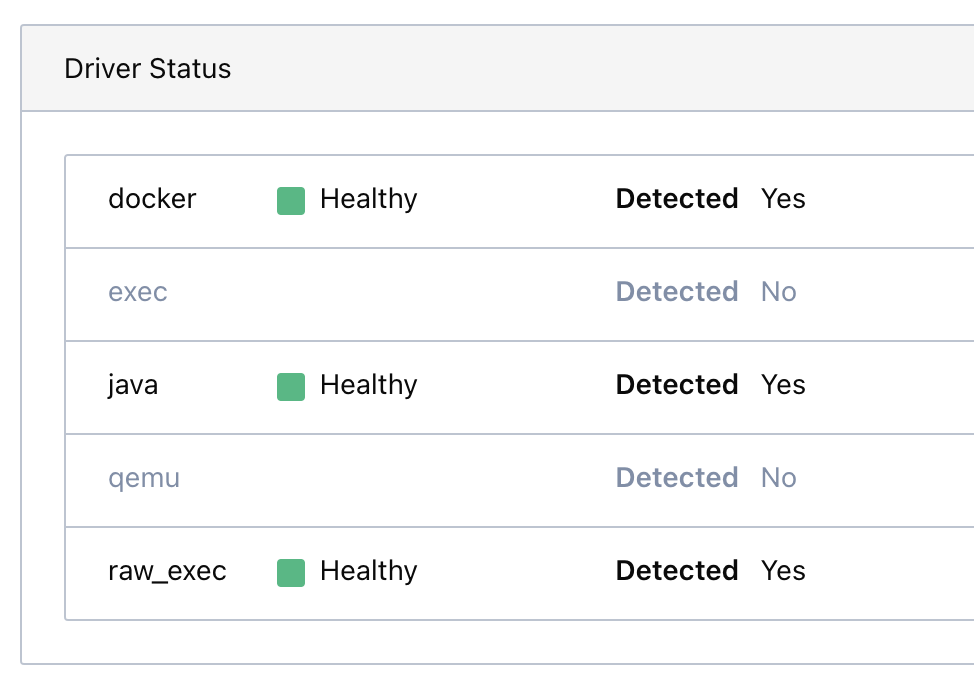

# ThirdAI Platform Deployment Guide

To deploy the ThirdAI Platform application locally for faster testing, we will run the main backend application from the commandline using Uvicorn pointing to the local application, and the application will launch training and inference sessions on a Nomad cluster running locally.

Without this process, it is cumbersome to test out platform changes. We would have to launch an entire cluster spread across multiple nodes, and build a docker image each time we would want to test out model bazaar changes. With the following framework, we can perform live updates to the backend of model bazaar during testing.

### Run ThirdAI Platform locally

## Setup Instructions

### Step 1: Install Required Tools and Services

1. **Install Nomad Locally:**
   - Follow the installation instructions at [HashiCorp's Nomad Installation Guide](https://developer.hashicorp.com/nomad/tutorials/get-started/gs-install). Choose platform-specific instructions for a simpler setup.

### Step 2: Configure and Run Local Services

2. **Start Nomad in Development Mode:**
   - Open a terminal session.
       - Since Nomad will run jobs locally, the Python environment that is currently running in the terminal sesssion must have all dependencies for all jobs:
       ```
       pip3 install -r headless/requirements.txt
       pip3 install -r thirdai_platform/requirements.txt
       ```
   - Open a terminal session and run:
     ```
     sudo nomad agent -dev -config="local_setup/agent.hcl"
     ```
   - Verify the Nomad cluster is operational by running `nomad node status` or visiting `http://localhost:4646` for the Nomad UI. Make sure that the status is `ready`.

3. **Configure and Launch Traefik:**
   - Install Traefik using Homebrew:
     ```
     brew install traefik
     ```
   - Run Traefik from another terminal session, first cd into ``local_setup`` folder and run
     ```
     bash launch_traefik.sh
     ```
4. **Set Up PostgreSQL:**
   - Install PostgreSQL([https://www.postgresql.org/download/](https://www.postgresql.org/download/)) if not already installed. On mac, you can just run `brew install postgresql`.
   - Start the service. On mac, you can run `brew services start postgresql`.
   - Run `psql postgres` inside the command line, then run the following SQL commands to configure the service:
     ```
     CREATE ROLE postgres WITH LOGIN SUPERUSER;
     ALTER ROLE postgres WITH PASSWORD 'yourpassword';
     ```
   - Run the following line inside the command line
     ```
     psql -U postgres -d postgres
     ```
   - Once, you're inside psql program, run the following:
     ```
     create database model_bazaar;
     ```
   - Connect to the database:
      ```
      \c model_bazaar;
      ```
   - Install the pgcrypto extension
      ```
      CREATE EXTENSION IF NOT EXISTS pgcrypto;
      ```
   - Create the grafana db:
      ```
      create database grafana;
      ```

### Step 3: Build and Deploy NeuralDB

5. **Configure Environment:**
   - Navigate back to the `thirdai_platform` directory. Modify `.env.example` to match your local setup for the   following values and save it as `.env`.
      - Change `DATABASE_URI` to be your local postgresql database connection string
      - Change `PUBLIC_MODEL_BAZAAR_ENDPOINT` and `PRIVATE_MODEL_BAZAAR_ENDPOINT` to be "http://localhost:80/" (make sure to include the trailing /)
      - Change `NOMAD_ENDPOINT` to "http://localhost:4646/"
      - Change `LICENSE_PATH` to point to your Rag on Rails license (look below for how to create a license file)
      - Change `SHARE_DIR` to point to an empty directory where all models and files will be saved.
      - Create a `JWT_SECRET` key for generating access token
      - Change the `SENDGRID_KEY`
      - Change the `PYTHON_PATH` to your virtual env python path.
      - Change `GENAI_KEY` to your Generative AI provider key, e.g. OpenAI key.


6. If you are running this dev environment on a Mac, navigate to the `thirdai_platform/backend/nomad_jobs` directory and make sure any hcl or hcl.j2 file doesn't have a line that is in the form of `cores = x`. If those lines exist, change the lines to be `cpu = x * 2500` (put the actual value of the multiplication, not x * 2500). Doing this will fix any issues related to resource allocation of Nomad jobs on MacOS, because running Docker on MacOS does funky things when trying to reserve CPUs.

7. **Alembic DB Upgrade**
    - After creating the Database apply alembic migrations to your DB by running the following command
      ```bash
      cd thirdai_platform
      export DATABASE_URI="your local database postgresql connection string"
      alembic upgrade head
      ```
8. **Start KeyCloak in dev mode when using Keycloak as IDP**
    - Download Keycloak version 26.0.0 from the official GitHub repository using the link below:
     [Download Keycloak 26.0.0](https://github.com/keycloak/keycloak/releases/download/26.0.0/keycloak-26.0.0.zip).
    - Extract the downloaded `keycloak-26.0.0.zip` file to a directory of your choice.
    - After extraction, you should have a directory named `keycloak-26.0.0`.
    - Open a terminal and navigate to the `keycloak-26.0.0` directory:
     ```bash
     cd keycloak-26.0.0/bin
     ```
    - Start the Keycloak server in development mode with the following command:
     ```bash
     ./kc.sh start-dev --http-port=8180 --debug --bootstrap-admin-username temp_admin --bootstrap-admin-password password
     ```
    - Wait for the server to start, and you should see a message indicating that the server is running. The server will be accessible at `http://localhost:8180`.
    - Once the server has started, you can access the Keycloak Admin Console by navigating to:
     [http://localhost:8180](http://localhost:8180).
    - Log in using the following credentials:
     - **Username**: `temp_admin`
     - **Password**: `password`
    - To stop the server, press `Ctrl+C` in the terminal where the server is running.
    - For more detailed instructions and advanced setup options, visit the official Keycloak documentation:
     [Getting Started with Keycloak ZIP](https://www.keycloak.org/getting-started/getting-started-zip).


9. **Launch Backend:**
    - Start the backend service using Uvicorn:
      ```
      uvicorn main:app --reload --host 0.0.0.0 --port 8000
      ```

10. **Launch Nomad Jobs**
    - Start the Autoscaler job and Redis job using the following command, first cd into `local_setup` folder and run
      ```
      bash launch_nomad_jobs.sh
      ```
    - Ensure Docker Desktop is running since the Autoscaler and Redis jobs use Docker as their driver. If you haven't installed Docker Desktop yet, you can download it [here](https://www.docker.com/products/docker-desktop/).

    - Once Docker Desktop is installed, open it and follow these steps:
      - Go to **Settings > Resources > File Sharing**.
      - Change the ownership of the `/opt/nomad` directory to your user account, Add the `/opt/nomad` directory to the file-sharing list.
      - You can change the ownership by running following command `sudo chown -R $(whoami) /opt/nomad`
      - Once you have done these changes, restart the docker desktop.
      - Now navigate to your nomad UI, go to clients and select your local client and see the driver status 
        
        


11. **Launch Frontend**

    To run the frontend, follow these steps:
    - Make sure you have `npm` installed to handle the dependencies. Navigate to the `frontend` directory and run `pnpm install` to install dependencies, if you dont have pnpm you can install it globally using `npm install -g pnpm`
    - Modify the following variables in `.env.example` and copy them to `.env` and save it inside `frontend` folder
      - Change `NEXT_PUBLIC_OPENAI_API_KEY` to openai-key you wanna use.
    - Finally to start you can run `pnpm dev`.
    - Your application should now be running, and you can access it in the browser at port 80.


12. **Insert existing datasets in DB:**
    - These existing datasets are present in the share directory of blade. 
    - Make sure you are on blade when you insert the datasets
    - Go to `thirdai_platform` folder and run
      ```
      python3 insert_datasets.py
      ```
    - The datasets should now reflect in your catalog table of db
    - The datasets will be saved in `datasets` folder inside your `SHARE_DIR`  

Extra steps that may help:
- Click the Apple icon at the top left of the screen, go to System Settings/Preferences -> Network -> Wi-Fi (or ethernet, whatever you are connected to) -> Details (next to the network you are connected to) -> TCP/IP, and where it says "Configure IPv6", change the value to "Link-Local Only". Click Ok to save the changes.
   

### Create NeuralDB Enterprise license file
1. Navigate into `thirdai_platform/licensing`.
2. Edit the variables `cpu_mhz_limit` and `expiry_date` in `thirdai_platform/licensing/generate/generate_license.py` to the desired values.
3. Run `python licensing/generate/generate_license.py`, and this should create a file called `ndb_enterprise_license.json` in the `thirdai_platform` directory.
4. Use this license file in the launching of the Thirdai platform application.


### Setting up HashiCorp Vault
You can use the following instructions to set it up:
https://waytohksharma.medium.com/install-hashicorp-vault-on-mac-fdbd8cd9113b


### Generating static documentation

We currently use Sphinx to generate our API documentation. However, Sphinx has known compatibility issues with the latest OpenAPI 3.1.0 specification, leading to problems in rendering the documentation correctly. Until this issue is resolved, we will use a temporary solution by generating static documentation using **ReDoc CLI**.

### Temporary Solution: Generating Static Documentation with ReDoc CLI

To generate static API documentation using **ReDoc CLI**, follow these steps:

1. **Install ReDoc CLI:**

   Make sure you have Node.js and npm installed. Then, install ReDoc CLI globally:

   ```bash
   npm install -g redoc-cli
2. **Generate the Static HTML Documentation:**
  
    Run the following command to generate the static HTML documentation:

    ```bash
    redoc-cli bundle http://localhost:8000/openapi.json -o ./redoc-static.html
    ```
    This command fetches the OpenAPI schema from your running FastAPI instance and generates a redoc-static.html file.

    http://localhost:8000/openapi.json: URL to your OpenAPI schema.
-o ./redoc-static.html: Output file path where the static HTML will be saved.

3. **See the documentation:**

    Now you can see the documentation by running ```open redoc-static.html```
    